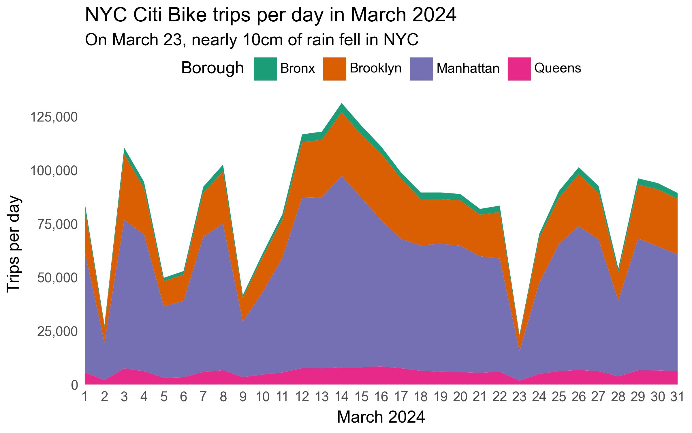

# Visualise Data


``` python
# Load packages
from pathlib import Path
import polars as pl
from plotnine import *
from mizani.labels import label_comma
```

``` python
# Import geospatial data
data_dir = Path("data")
neighbourhoods = pl.read_parquet(data_dir / "nyc-neighbourhoods.parquet")
n_neighbourhoods = neighbourhoods.height
print(neighbourhoods)
trips = pl.read_parquet(data_dir / "202403-citibike-tripdata.csv.parquet")
print(trips)
```

    shape: (258, 3)
    ┌─────────────────┬──────────┬─────────────────────────────────┐
    │ neighborhood    ┆ borough  ┆ polygon                         │
    │ ---             ┆ ---      ┆ ---                             │
    │ str             ┆ str      ┆ list[list[f64]]                 │
    ╞═════════════════╪══════════╪═════════════════════════════════╡
    │ Allerton        ┆ Bronx    ┆ [[-73.848597, 40.87167], [-73.… │
    │ Alley Pond Park ┆ Queens   ┆ [[-73.743333, 40.738883], [-73… │
    │ Arverne         ┆ Queens   ┆ [[-73.789535, 40.599972], [-73… │
    │ Astoria         ┆ Queens   ┆ [[-73.901603, 40.76777], [-73.… │
    │ Bath Beach      ┆ Brooklyn ┆ [[-73.99381, 40.60195], [-73.9… │
    │ …               ┆ …        ┆ …                               │
    │ Williamsburg    ┆ Brooklyn ┆ [[-73.957572, 40.725097], [-73… │
    │ Windsor Terrace ┆ Brooklyn ┆ [[-73.980061, 40.660753], [-73… │
    │ Woodhaven       ┆ Queens   ┆ [[-73.86233, 40.695962], [-73.… │
    │ Woodlawn        ┆ Bronx    ┆ [[-73.859468, 40.900517], [-73… │
    │ Woodside        ┆ Queens   ┆ [[-73.900866, 40.757674], [-73… │
    └─────────────────┴──────────┴─────────────────────────────────┘
    shape: (2_663_295, 13)
    ┌───────────┬───────────┬───────────┬───────────┬───┬───────────┬───────────┬───────────┬──────────┐
    │ ride_id   ┆ rideable_ ┆ started_a ┆ ended_at  ┆ … ┆ start_lng ┆ end_lat   ┆ end_lng   ┆ member_c │
    │ ---       ┆ type      ┆ t         ┆ ---       ┆   ┆ ---       ┆ ---       ┆ ---       ┆ asual    │
    │ str       ┆ ---       ┆ ---       ┆ datetime[ ┆   ┆ f64       ┆ f64       ┆ f64       ┆ ---      │
    │           ┆ str       ┆ datetime[ ┆ μs]       ┆   ┆           ┆           ┆           ┆ str      │
    │           ┆           ┆ μs]       ┆           ┆   ┆           ┆           ┆           ┆          │
    ╞═══════════╪═══════════╪═══════════╪═══════════╪═══╪═══════════╪═══════════╪═══════════╪══════════╡
    │ 9EC2AD5F3 ┆ classic_b ┆ 2024-02-2 ┆ 2024-03-0 ┆ … ┆ -73.9028  ┆ null      ┆ null      ┆ member   │
    │ F8C8B57   ┆ ike       ┆ 9 00:20:2 ┆ 1 01:20:2 ┆   ┆           ┆           ┆           ┆          │
    │           ┆           ┆ 7.570     ┆ 2.196     ┆   ┆           ┆           ┆           ┆          │
    │ C76D82D96 ┆ classic_b ┆ 2024-02-2 ┆ 2024-03-0 ┆ … ┆ -73.96417 ┆ null      ┆ null      ┆ member   │
    │ 516BDC2   ┆ ike       ┆ 9 07:54:3 ┆ 1 08:54:1 ┆   ┆ 9         ┆           ┆           ┆          │
    │           ┆           ┆ 4.223     ┆ 2.611     ┆   ┆           ┆           ┆           ┆          │
    │ B4C73C958 ┆ electric_ ┆ 2024-02-2 ┆ 2024-03-0 ┆ … ┆ -73.97121 ┆ null      ┆ null      ┆ member   │
    │ C65FEA6   ┆ bike      ┆ 9 08:47:0 ┆ 1 09:47:0 ┆   ┆ 2         ┆           ┆           ┆          │
    │           ┆           ┆ 9.664     ┆ 2.393     ┆   ┆           ┆           ┆           ┆          │
    │ E23F7822B ┆ classic_b ┆ 2024-02-2 ┆ 2024-03-0 ┆ … ┆ -73.98185 ┆ null      ┆ null      ┆ member   │
    │ 3D53E2A   ┆ ike       ┆ 9 09:57:0 ┆ 1 10:57:0 ┆   ┆ 4         ┆           ┆           ┆          │
    │           ┆           ┆ 7.150     ┆ 0.848     ┆   ┆           ┆           ┆           ┆          │
    │ B0B6437C5 ┆ electric_ ┆ 2024-02-2 ┆ 2024-03-0 ┆ … ┆ -73.94514 ┆ null      ┆ null      ┆ member   │
    │ 0C3AB3E   ┆ bike      ┆ 9 10:29:4 ┆ 1 11:29:2 ┆   ┆           ┆           ┆           ┆          │
    │           ┆           ┆ 1.981     ┆ 1.539     ┆   ┆           ┆           ┆           ┆          │
    │ …         ┆ …         ┆ …         ┆ …         ┆ … ┆ …         ┆ …         ┆ …         ┆ …        │
    │ 197C0ABDD ┆ classic_b ┆ 2024-03-3 ┆ 2024-03-3 ┆ … ┆ -73.97109 ┆ 40.763126 ┆ -73.96526 ┆ member   │
    │ 3348135   ┆ ike       ┆ 1 23:55:3 ┆ 1 23:59:0 ┆   ┆ 2         ┆           ┆ 9         ┆          │
    │           ┆           ┆ 7.938     ┆ 8.301     ┆   ┆           ┆           ┆           ┆          │
    │ 702FEBD6D ┆ classic_b ┆ 2024-03-3 ┆ 2024-03-3 ┆ … ┆ -73.95962 ┆ 40.81     ┆ -73.95515 ┆ member   │
    │ 9CCE4BC   ┆ ike       ┆ 1 23:55:4 ┆ 1 23:57:2 ┆   ┆ 1         ┆           ┆ 1         ┆          │
    │           ┆           ┆ 0.087     ┆ 6.335     ┆   ┆           ┆           ┆           ┆          │
    │ ECA4FC659 ┆ electric_ ┆ 2024-03-3 ┆ 2024-03-3 ┆ … ┆ -73.96597 ┆ 40.712605 ┆ -73.96264 ┆ member   │
    │ 50ADDDB   ┆ bike      ┆ 1 23:55:4 ┆ 1 23:57:2 ┆   ┆ 1         ┆           ┆ 4         ┆          │
    │           ┆           ┆ 1.173     ┆ 5.079     ┆   ┆           ┆           ┆           ┆          │
    │ D8B20517A ┆ classic_b ┆ 2024-03-3 ┆ 2024-03-3 ┆ … ┆ -73.99673 ┆ 40.714193 ┆ -73.99673 ┆ member   │
    │ 4AB7D60   ┆ ike       ┆ 1 23:56:1 ┆ 1 23:57:1 ┆   ┆ 2         ┆           ┆ 2         ┆          │
    │           ┆           ┆ 7.935     ┆ 8.475     ┆   ┆           ┆           ┆           ┆          │
    │ 6BC5FAFEA ┆ electric_ ┆ 2024-03-3 ┆ 2024-03-3 ┆ … ┆ -73.94029 ┆ 40.703172 ┆ -73.94063 ┆ member   │
    │ C948FB1   ┆ bike      ┆ 1 23:57:1 ┆ 1 23:59:2 ┆   ┆ 7         ┆           ┆ 6         ┆          │
    │           ┆           ┆ 6.025     ┆ 2.134     ┆   ┆           ┆           ┆           ┆          │
    └───────────┴───────────┴───────────┴───────────┴───┴───────────┴───────────┴───────────┴──────────┘

``` python
# Transform DataFramen from polygons in lists to one row per coordinate column
neighbourhoods_coords = (
    neighbourhoods.with_row_index("id")
    .explode("polygon")
    .with_columns(
        lon = pl.col("polygon").list.first(),
        lat = pl.col("polygon").list.last()
    )
    .drop("polygon")
)
print(neighbourhoods_coords)
```

    shape: (27_569, 5)
    ┌─────┬──────────────┬─────────┬────────────┬───────────┐
    │ id  ┆ neighborhood ┆ borough ┆ lon        ┆ lat       │
    │ --- ┆ ---          ┆ ---     ┆ ---        ┆ ---       │
    │ u32 ┆ str          ┆ str     ┆ f64        ┆ f64       │
    ╞═════╪══════════════╪═════════╪════════════╪═══════════╡
    │ 0   ┆ Allerton     ┆ Bronx   ┆ -73.848597 ┆ 40.87167  │
    │ 0   ┆ Allerton     ┆ Bronx   ┆ -73.845823 ┆ 40.870239 │
    │ 0   ┆ Allerton     ┆ Bronx   ┆ -73.854559 ┆ 40.859954 │
    │ 0   ┆ Allerton     ┆ Bronx   ┆ -73.854665 ┆ 40.859586 │
    │ 0   ┆ Allerton     ┆ Bronx   ┆ -73.856389 ┆ 40.857594 │
    │ …   ┆ …            ┆ …       ┆ …          ┆ …         │
    │ 257 ┆ Woodside     ┆ Queens  ┆ -73.910618 ┆ 40.755476 │
    │ 257 ┆ Woodside     ┆ Queens  ┆ -73.90907  ┆ 40.757565 │
    │ 257 ┆ Woodside     ┆ Queens  ┆ -73.907828 ┆ 40.756999 │
    │ 257 ┆ Woodside     ┆ Queens  ┆ -73.90737  ┆ 40.756988 │
    │ 257 ┆ Woodside     ┆ Queens  ┆ -73.900866 ┆ 40.757674 │
    └─────┴──────────────┴─────────┴────────────┴───────────┘

``` python
# Calculate median coordinate of start location of each bike trip, per station
stations = (
    trips.group_by(station = pl.col("start_station_name"))
    .agg(
        lon = pl.col("start_lng").median(),
        lat = pl.col("start_lat").median()
    )
    .sort("station")
    .drop_nulls()
)
print(stations)
```

    shape: (2_143, 3)
    ┌──────────────────────────────┬────────────┬───────────┐
    │ station                      ┆ lon        ┆ lat       │
    │ ---                          ┆ ---        ┆ ---       │
    │ str                          ┆ f64        ┆ f64       │
    ╞══════════════════════════════╪════════════╪═══════════╡
    │ 1 Ave & E 110 St             ┆ -73.938203 ┆ 40.792327 │
    │ 1 Ave & E 16 St              ┆ -73.981656 ┆ 40.732219 │
    │ 1 Ave & E 18 St              ┆ -73.980544 ┆ 40.733876 │
    │ 1 Ave & E 30 St              ┆ -73.975361 ┆ 40.741457 │
    │ 1 Ave & E 38 St              ┆ -73.971822 ┆ 40.746202 │
    │ …                            ┆ …          ┆ …         │
    │ Wyckoff Ave & Stanhope St    ┆ -73.917914 ┆ 40.703545 │
    │ Wyckoff St & 3 Ave           ┆ -73.982586 ┆ 40.682755 │
    │ Wythe Ave & Metropolitan Ave ┆ -73.963198 ┆ 40.716887 │
    │ Wythe Ave & N 13 St          ┆ -73.957099 ┆ 40.722741 │
    │ Yankee Ferry Terminal        ┆ -74.016756 ┆ 40.687066 │
    └──────────────────────────────┴────────────┴───────────┘

``` python
# Save stations DataFrame
stations.write_parquet(data_dir / "stations.parquet")
```

``` python
n_stations = stations.height
print(n_stations)
```

    2143

``` python
nyc_map = (
    ggplot(neighbourhoods_coords, aes(x = "lon", y = "lat", group = "id"))
    + geom_polygon(aes(alpha = "neighborhood", fill = "borough"), color = "white")
    + geom_point(stations, size = 0.1)
    + scale_x_continuous(expand = (0, 0))
    + scale_y_continuous(expand = (0, 0, 0, 0.01))
    + scale_alpha_ordinal(range = (0.3, 1))
    + scale_fill_brewer(type = "qual", palette = 2)
    + guides(alpha= False)
    + labs(
        title = "New York City neighbourhoods and Citi Bike stations",
        subtitle = f"{n_stations} stations across {n_neighbourhoods} neighbourhoods",
        caption = "Source: https://citibikenyc.com/system-data",
        fill = "Borough"
    )
    + theme_void(base_family = "Guardian Sans", base_size = 14)
    + theme(
        dpi = 300,
        figure_size = (14, 18),
        plot_background = element_rect(fill = "white", color = "white"),
        plot_caption = element_text(style = "italic"),
        plot_margin = 0.01,
        plot_title = element_text(ha = "left")
    )
)
nyc_map.save("img/nyc_map.png", dpi = 300)
```


# Plot Daily Trips by Borough

``` python
trips = pl.read_parquet(data_dir / "trips_stations_borough_neighbourhood.parquet")

trips_per_day = trips.group_by_dynamic(
  "datetime_start", group_by = "borough_start", every = "1d"
).agg(num_trips = pl.len())
print(trips_per_day)
```

    shape: (124, 3)
    ┌───────────────┬─────────────────────┬───────────┐
    │ borough_start ┆ datetime_start      ┆ num_trips │
    │ ---           ┆ ---                 ┆ ---       │
    │ str           ┆ datetime[μs]        ┆ u32       │
    ╞═══════════════╪═════════════════════╪═══════════╡
    │ Bronx         ┆ 2024-03-01 00:00:00 ┆ 2748      │
    │ Bronx         ┆ 2024-03-02 00:00:00 ┆ 1010      │
    │ Bronx         ┆ 2024-03-03 00:00:00 ┆ 3084      │
    │ Bronx         ┆ 2024-03-04 00:00:00 ┆ 3072      │
    │ Bronx         ┆ 2024-03-05 00:00:00 ┆ 1623      │
    │ …             ┆ …                   ┆ …         │
    │ Manhattan     ┆ 2024-03-27 00:00:00 ┆ 61358     │
    │ Manhattan     ┆ 2024-03-28 00:00:00 ┆ 35328     │
    │ Manhattan     ┆ 2024-03-29 00:00:00 ┆ 61451     │
    │ Manhattan     ┆ 2024-03-30 00:00:00 ┆ 57877     │
    │ Manhattan     ┆ 2024-03-31 00:00:00 ┆ 54440     │
    └───────────────┴─────────────────────┴───────────┘

``` python
trips_per_day_plot = (
  ggplot(
    trips_per_day,
    aes(x = "datetime_start", y = "num_trips", fill = "borough_start")
  )
  + geom_area()
  + scale_fill_brewer(type = "qual", palette = 2)
  + scale_x_datetime(date_labels = "%-d", date_breaks = "1 day", expand = (0, 0))
  + scale_y_continuous(labels = label_comma(), expand = (0, 0))
  + labs(
    x = "March 2024",
    fill = "Borough",
    y = "Trips per day",
    title = "NYC Citi Bike trips per day in March 2024",
    subtitle = "On March 23, nearly 10cm of rain fell in NYC"
  )
  + theme_tufte(base_family = "Arial", base_size = 14)
  + theme(
    axis_ticks_major = element_line(color = "white"),
    figure_size = (8, 5),
    legend_position = "top",
    plot_background = element_rect(fill = "white", color = "white"),
    plot_caption = element_text(style = "italic"),
    plot_title = element_text(ha = "left")
  )
)
trips_per_day_plot.save("img/trips_per_day.png", dpi = 300)
```


