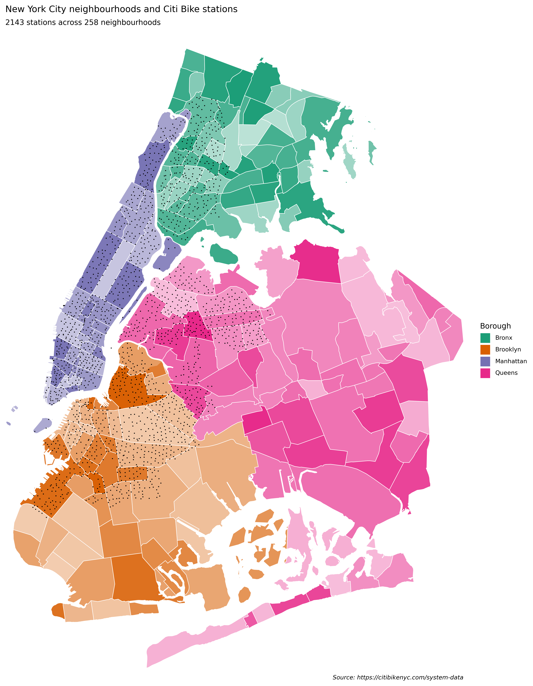

# NYC Bike Trips


# Overview



- [Collect & Transform](01_collect_transform.md)

- [Visualise](02_visualise.md)

This repo is based on code written for the book [Python Polars: The
Definitive
Guide](https://github.com/jeroenjanssens/python-polars-the-definitive-guide)
by Janssens and Nieuwdorp.

# Installation

- `uv`

- `polars`

``` {bash}
uv add 'polars[gpu]'
```

- `plotnine`

- `quarto` for scientific publishing

- `sphinx` for documentation

- `rust` for `polars_geo` plugin:

- [Install Rust](https://www.rust-lang.org/tools/install)

- Or update Rust with `rustup update`

- `maturin` for installing `polars_geo` Rust plugin:

- [Install maturin](https://www.maturin.rs/installation.html)

- Build the plugin (see [Collect & Transform](01_collect_transform.md));
  we had to update the versions of some dependencies to make it work

Testing:

- `tox` for running test suite

- `behave` for User Acceptance Testing (UAT)

- `pytest` for unit testing

# To Use Polars with GPU Engine

## Test

``` python
import polars as pl
pl.LazyFrame({"x": [1, 2, 3]}).collect(engine=pl.GPUEngine(raise_on_fail=True))
```

<div>

<div><style>
.dataframe > thead > tr,
.dataframe > tbody > tr {
  text-align: right;
  white-space: pre-wrap;
}
</style>
<small>shape: (3, 1)</small>

| x   |
|-----|
| i64 |
| 1   |
| 2   |
| 3   |

</div>

</div>

## Execute

``` python
#lf.collect(engine='GPU')
```

# Development

In the `docs` directory, initialise the documentation:

``` {bash}
uv run sphinx-quickstart
```

After populating the `docs` files `index.rst`, `overview.rst`,
`api.rst`, add the following to the `conf.py` file:

``` python
extensions = [
    'sphinx.ext.todo'
]

todo_include_todos = True
```

Then, build the documentation:

``` {bash}
uv run make html
```

Tox:

``` {bash}
uv tool install tox
```
